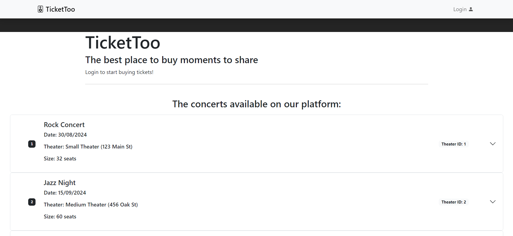
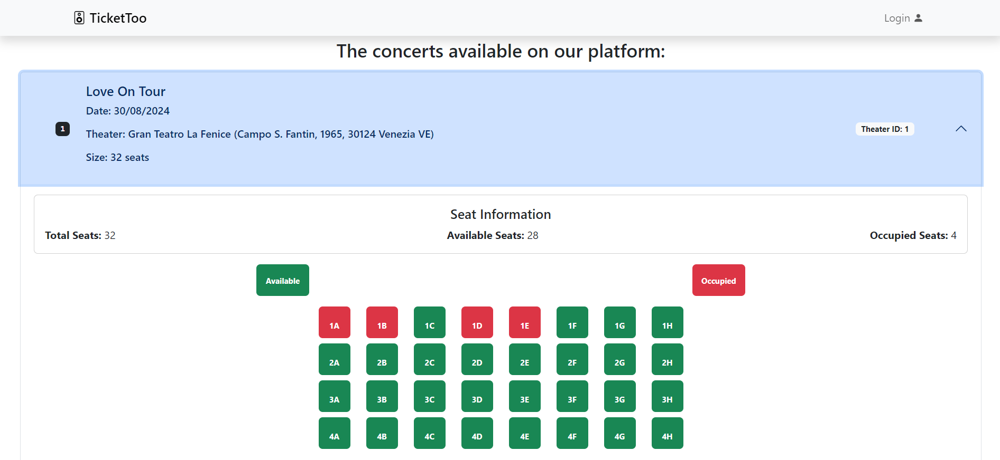
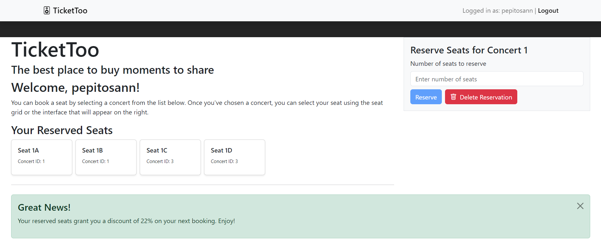
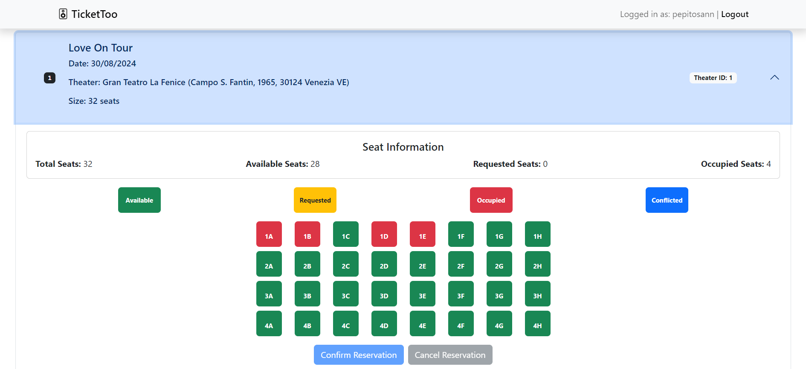

[](https://classroom.github.com/a/XYY1fduM)
# Exam #3: "Concert Seats"
## Student: s329425 ARMENANTE PIETRO 

## React Client Application Routes

Route `/`: list of concerts, theaters they are associated to and seats (accessible pressing on the desired concert), accessible by anybody (both authenticated or not), the seat reservation window and the revervation grid method, ONLY for authenticated users (accessible only after the selection of a concert).
Route `/login`: login form. After successful login, it redirect to / with the possibility to select a concert and reserve seats
Route `*`: not found page

## API Server

- GET `/api/concerts` - API to get all the concerts
  - **Response body**: JSON object with the list of concerts, or description of the error(s):
    ```
    [ { "id": "1", "name": "Love On Tour", "date": 2024-08-30, "theater_id": 1 }, ... ]
    ```
  - Codes: `200 OK`, `500 Internal Server Error`.

- GET `/api/theaters` - API to get all the theaters
  - **Response body**: JSON object with the list of theaters, or description of the error(s):
    ```
    [ { "id": "1", "name": "Gran Teatro La Fenice", "adress": "Campo S. Fantin, 1965, 30124 Venezia VE", "rows": 4, "columns": 8 }, ... ]
    ```
  - Codes: `200 OK`, `500 Internal Server Error`.

- GET `/api/seats` - API to get all the seats
  - **Response body**: JSON object with the list of seats, or description of the error(s):
    ```
    [ { "id": "1", "code": "1A", "row": 1, "columns": A, "concert_id": 1, "status": "occupied"}, ... ]
    ```
  - Codes: `200 OK`, `500 Internal Server Error`.

- GET `/api/user-seat-id/:seatIds` - API to get the seats with some specific ids
  - **Request**: list of seats:
    ```
    { "seatIds": 95, 96, 3, 7, ... }
    ```
  - **Response body**: JSON object with the list of reserved seat information done by a user, or description of the error(s):
    ```
    [ { "id": 95, "code": "1C", "row": 1, "column": "C", "concert_id": 3, "status": "occupied" }, ... ]
    ```
  - Codes: `200 OK`, `401 Unauthorized`, `400 Bad Request` (invalid request body), `500 Internal Server Error`.

- GET `/api/user-reservations` - API to get the reservation of the user
  - **Response body**: JSON object with the list of reservation done by a user, or description of the error(s):
    ```
    [ { id: 9, user_id: 1, concert_id: 1 }, ... ]
    ```
  - Codes: `200 OK`, `401 Unauthorized`, `400 Bad Request` (invalid request body), `500 Internal Server Error`.

- GET `/api/user-seats` - API to get the reserved seats of the user
  - **Response body**: JSON object with the list of seats reserved by a user, or description of the error(s):
    ```
    [ { id: 3, reservation_id: 2, seat_id: 95, concert_id: 3 }, ... ]
    ```
  - Codes: `200 OK`, `401 Unauthorized`, `400 Bad Request` (invalid request body), `500 Internal Server Error`.

- DELETE `/api/reserved-seats` - API to delete the current reserved seats for the currently logged in user for the specific concert
  - **Response body**: Empty on success, otherwise a JSON object with the error.
  - Codes: `200 OK`, `401 Unauthorized`, `500 Internal Server Error`.
  
- POST `/api/seats-update` - API to reserve seats for a concert
  - **Request**: JSON object with seatsToReserve (seats to reserve for user for the specific concert):   
    ```
    { "seatsToReserve": [ { "id": 95, "code": "1C", "row": 1, "column": "C", "concert_id": 3, "status": "occupied" }, ... ] }
    ```
  - **Response body**: Empty on success, or a JSON object with error description:
    ```
    { "errors": [ "Failed to reserve seats. Please try again later." ] }
    ```
  - Codes: `200 OK`, `401 Unauthorized`, `400 Bad Request` (invalid request body), `409 Conflict` (indicates a request conflict with the current state of the target resource), `500 Internal Server Error`.

- GET `/api/auth-token` : API to provide an authentication token for the logged in user. it returns a JSON object with token.
  - **Response body**: JSON object with token
  - **Token payload**: loyal flag and userId
    ```
    { loyal: 1, userId: 1 }
    ```
  - Codes: `200 OK`, `401 Unauthorized`.
  
### Authentication API

- POST `/api/session` : API to authenticate the user and create a session. Username and password are passed to the server. It returns a JSON object with the user's username or a description of the errors.
  - **Request**: JSON object with username and password:
    ```
    { "username": "pepitosann", "password": "fiorentina" }
    ```
  - **Response body**: JSON object with the user's username or a description of the errors:   
    ```
    { "username": "pepitosann" }
    ```
  - Codes: `200 OK`, `401 Unauthorized` (incorrect email and/or password), `400 Bad Request` (invalid request body), `500 Internal Server Error`.

- DELETE `/api/session`: API to logs the user out
  - Codes: `200 OK`, `401 Unauthorized`.

## API Server2

- POST `/api/discount` : API to post the discount for the next year’s concert season. The currently reserved seats per user and its 'loyalty' state is passed to the server. It returns a JSON object with the discount.
  - **Request**: JSON object with a list of seats to reserve and the loyalty flag   
    ```
    { "seatsRes": [ { "id": 95, "code": "1C", "row": 1, "column": "C", "concert_id": 3, "status": "occupied" }, ... ], loyalty: 1 }
    ```
  - **Response body**: EJSON object with the discount
    ```
    { "discount": 15 }
    ```
  - Codes: `200 OK`, `401 Unauthorized`, `400 Bad Request` (invalid request body).

## Database Tables

- Table `theaters` - contains id, name, address, rows, columns - stores the theaters
- Table `concerts` - contains id, name, date, theater_id - stores the concerts
- Table `seats` - contains id, code, row, column, concert_id, status - stores the seats
- Table `users` - contains id, username, hash of the pwd, salt, loyal - stores the user.
- Table `resevations` - contains id, user_id, concert_id - stores the relationship between the user and the concert he has reserved some seats
- Table `reserved_seats` - contains id, reservation_id, seat_id - stores the relationship between the reservation (concert - user) and the actual seats reserved

## Main React Components

- `Main` (in `App.js`) : technically a component, takes the role of App and is rendered inside a Router to be able to use the useNavigate hook. This maintains most of the state of the app.

- `ConcertList` (in `ConcertList.jsx`) : the list of all the concerts.
- `ConcertItem` (in `ConcertList.jsx`) : a single concert in the ConcertList. The usage of an Accordion React componentn permits to see some core information about the model like the its id, name and the date. Moreover it is possible to see which is the theaters in which the concert will be done (its id, name and size). Those information are taken from a secondary component, the `Theater` (used in this case only to permit the user to see more information about a specific concert). The accordion can be expanded to see the information about the seats of the theater for that concert (available seats, occupied seats) both in textual form and in graphical form. When in logged in, the grid can be used to select the seats, directly pressing on them. Some button (confirm, cancel) and further information will be displayed (requested seats, conflicted seats).
- `ConcertItemDetail` (in `ModelList.jsx`) : the body of a ConcertItem's accordion item.

- `SeatGrid` (in `SeatGrid.jsx`) : the component used to create the seat grid in the accordion body. It shows the total number of seats per theater, the available ones, the requested ones and the occupied ones. Its main part is related on the actual grid and the management of the visualization in different colours of the seats' state. In the authenticated view, two buttons will appear: one for the confirmation of the reserved seats thanks to the visual method; the other for the cancellation of the seats (undo operation).

- `SeatReservation` (in `SeatReservation.jsx`) : the component used to create the seat reservation window. It appears on the right of the page as a user log in and select a concert pressing on the accordion body related to that concert. It is formed by a form in which the user can type the number of seats to reserve. The seats are going to be selected row by row. Once a valid number is inserted, the user can press on the confimation button to reserve the seats. Moreover, a delete button can be used to delete the reserved seats and starting reserving other seats for that concert. This button can be used to delete seats both for the "numberical" method and the "graphic" one. 

- `LoginForm` (in `LoginForm.jsx`) : the login form that user can use to login into the app. This is responsible for the client-side validation of the login credentials (valid username and non-empty password).

## Screenshot






## Users Credentials

| username | password  | client type |
|-------|----------|-------------|
| pepitosann | fiorentina | loyal client |
| luca | spugna | loyal client |
| saimon | sicilia | none |
| cricod | pistola | none |
| elidegiu | colosseo | loyal client |
| nicco | firenze | none |